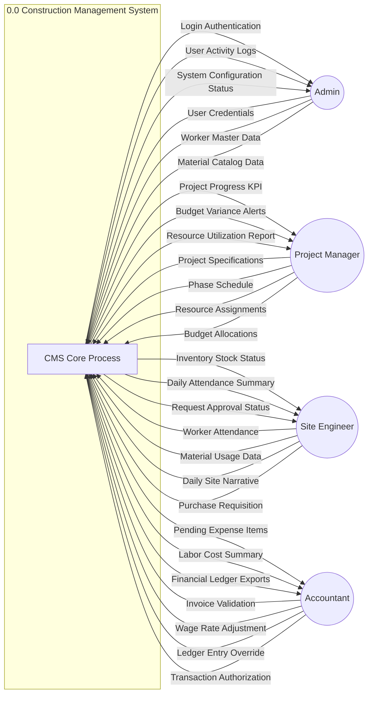
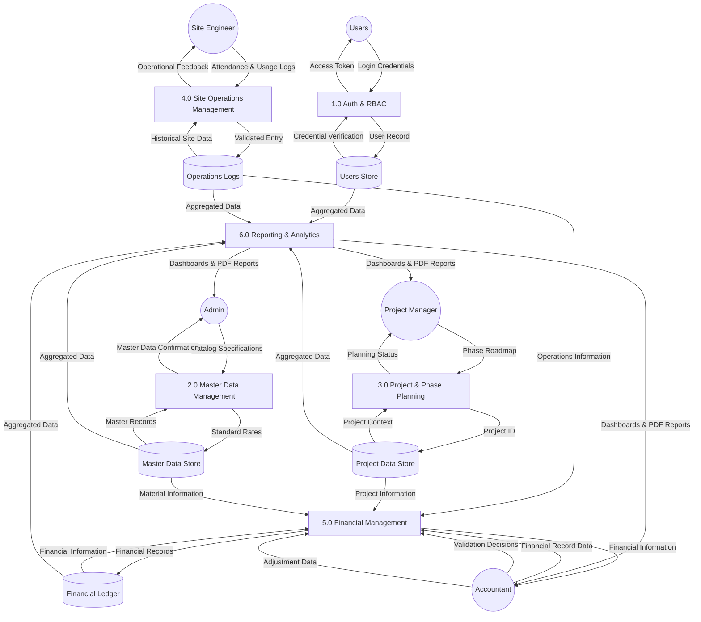
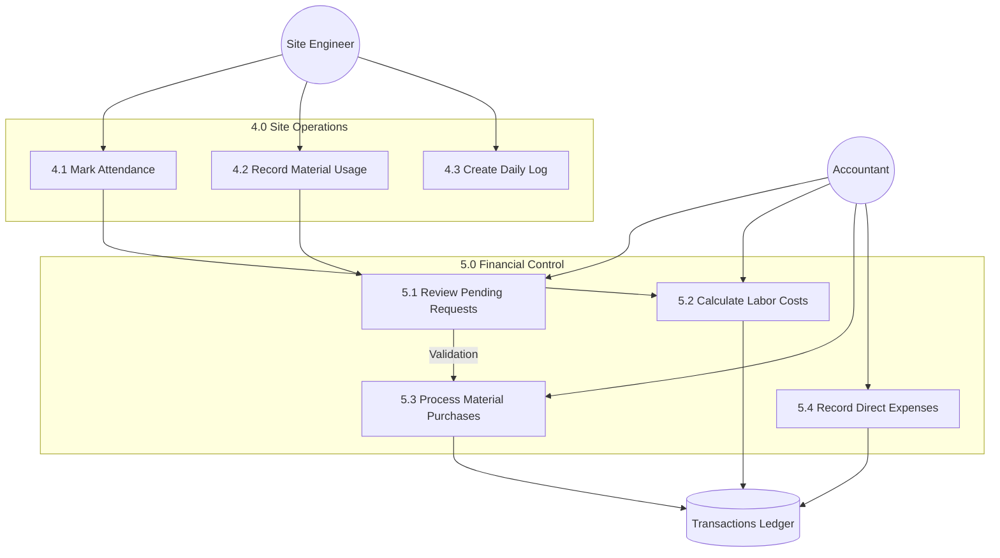
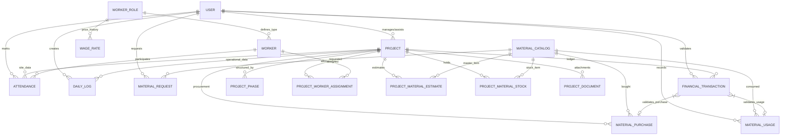

# Project Synopsis: Construction Management System (CMS)

## 1. Title of the Project
**Construction Management System (CMS)** - A Unified Platform for Project Lifecycle, Operational Tracking, and Financial Integrity.

## 2. Introduction
The Construction Management System (CMS) is a comprehensive web-based application designed to bridge the gap between on-site operations and back-office financial oversight. Construction projects are notoriously complex, involving hundreds of workers, volatile material stocks, and strict budget constraints. 

CMS provides a "single source of truth" where Site Engineers record daily progress (attendance, material usage, logs), Project Managers plan phases and assign resources, and Accountants validate financial activities before they enter the immutable project ledger. The system emphasizes **financial traceability** and **operational accountability** through a robust "Gatekeeper" validation lifecycle.

## 3. Objective
*   **Operational Efficiency**: Automate site attendance, daily logging, and material request workflows.
*   **Resource Management**: Efficiently assign and track workers and material estimates across multiple project phases.
*   **Financial Integrity**: Implement a validation layer where accountants review site activities (Gatekeeper Pattern) before recording transactions.
*   **Auditability**: Maintain a clear audit trail for all financial adjustments, including original amounts and override reasons.
*   **Real-time Oversight**: Provide role-based dashboards with live KPIs (budget utilization, project progress, stock levels).
*   **Standardization**: Normalize data (Enums, units, roles) to ensure consistent reporting across the organization.

## 4. Tools and Technology to be used
### Backend
*   **Language**: Python 3.12+
*   **Framework**: FastAPI (High-performance asynchronous API)
*   **ORM**: SQLAlchemy 2.0 (Relational mapping)
*   **Database**: SQLite (Local development/Light production)
*   **Tooling**: Ruff (Linting/Formatting), UV (Fast package management)

### Frontend
*   **Library**: React 19 (Component-based UI)
*   **Build Tool**: Vite (Fast development server)
*   **Styling**: Tailwind CSS 4 & Shadcn/UI (Modern, responsive design)
*   **State Management**: Zustand (Lightweight store)
*   **Icons/Charts**: Lucide React & Recharts

### Infrastructure
*   **Authentication**: JWT (JSON Web Tokens) with HTTP Bearer security.
*   **API Pattern**: RESTful architecture with structured JSON responses.

## 5. Work Breakdown Structure (WBS)
1.  **Phase 1: Core Infrastructure**
    *   Database schema design and normalization.
    *   Authentication and Role-Based Access Control (RBAC).
    *   System-wide Audit Logging for security and traceability.
    *   User and Master Data (Workers, Materials) management.
2.  **Phase 2: Project Planning**
    *   Project creation and lifecycle management (Draft → Planning → Active → Completed).
    *   Phase-wise roadmap development.
    *   Material estimation and stock initialization.
3.  **Phase 3: Site Operations**
    *   Daily attendance marking and reporting.
    *   Material usage tracking and stock deduction.
    *   Daily logs for issue tracking and progress notes.
    *   Material procurement requests.
4.  **Phase 4: Financial Controls (The Gatekeeper)**
    *   Procurement processing (Approve/Reject/Override).
    *   Labor cost generation based on attendance and wage rates.
    *   Manual expense recording.
    *   Immutable ledger (Financial Transactions) with override audit trails.
5.  **Phase 5: Reporting & Analytics**
    *   Project summary dashboards.
    *   Budget burn-down and utilization reports.
    *   Stock alerts and worker allocation maps.

## 6. Diagrams

### Data Flow Diagram (DFD)

#### Level 0: Context Diagram (Academic Detail)

#### Level 1: Functional Decomposition

#### Level 2: Site & Financial Operations (Detail)

### E-R Diagram (Complete)

## 7. Data Dictionary (Complete)

| Entity | Description | Attributes |
| :--- | :--- | :--- |
| **User** | System actors with RBAC | `id`, `email`, `full_name`, `password_hash`, `role`, `is_active` |
| **Project** | Main construction venture | `id`, `name`, `client_name`, `location`, `budget`, `status`, `start_date`, `end_date`, `pm_id`, `se_id` |
| **Worker** | Human resources | `id`, `name`, `role_id`, `status`, `is_active` |
| **WorkerRole** | Skills categorization | `id`, `name`, `description` |
| **WageRate** | Historical wage data | `id`, `role_id`, `daily_rate`, `effective_from` |
| **MaterialCatalog**| Global materials inventory | `id`, `name`, `unit`, `unit_price`, `category` |
| **ProjectPhase** | Project timeline segment | `id`, `project_id`, `name`, `order`, `status`, `progress_%` |
| **Attendance** | Daily site presence | `id`, `project_id`, `worker_id`, `date`, `status`, `marked_by` |
| **DailyLog** | Site progress narrative | `id`, `project_id`, `date`, `summary`, `issues`, `created_by` |
| **MaterialUsage** | On-site consumption | `id`, `project_id`, `material_id`, `quantity`, `date`, `recorded_by` |
| **MaterialRequest**| Site-to-office procurement | `id`, `project_id`, `material_id`, `quantity`, `status`, `requested_by` |
| **MaterialPurchase**| Actual procurement record | `id`, `project_id`, `material_id`, `quantity`, `unit_price`, `payment_status` |
| **Transaction** | Immutable ledger record | `id`, `amount`, `category`, `payment_status`, `override_flag`, `audit_fields` |
| **Document** | Project attachments | `id`, `project_id`, `filename`, `file_size`, `uploaded_by` |

## 8. Table Structure (Detailed Schema)

### 1. Users & Security

#### `users`
- `id`: `Integer` (PK, Autoincrement)
- `email`: `String(255)` (Unique, Not Null, Indexed)
- `full_name`: `String(255)` (Not Null)
- `password_hash`: `String(512)` (Not Null)
- `role`: `Enum` (`admin`, `project_manager`, `site_engineer`, `accountant`) (Not Null)
- `is_active`: `Boolean` (Default: True, Not Null)
- `created_at`: `DateTime` (Not Null)
- `updated_at`: `DateTime` (Not Null)

#### `audit_logs`
- `id`: `Integer` (PK, Autoincrement)
- `user_id`: `Integer` (FK -> `users.id`, Nullable)
- `action`: `String(100)` (Not Null)
- `entity_type`: `String(100)` (Nullable)
- `entity_id`: `Integer` (Nullable)
- `details`: `Text` (Nullable)
- `ip_address`: `String(45)` (Nullable)
- `timestamp`: `DateTime` (Not Null)

### 2. Master Data Management

#### `worker_roles`
- `id`: `Integer` (PK, Autoincrement)
- `name`: `String(100)` (Unique, Not Null)
- `description`: `Text` (Nullable)

#### `wage_rates`
- `id`: `Integer` (PK, Autoincrement)
- `worker_role_id`: `Integer` (FK -> `worker_roles.id`, Not Null)
- `daily_rate`: `Float` (Not Null)
- `effective_from`: `Date` (Not Null)

#### `workers`
- `id`: `Integer` (PK, Autoincrement)
- `name`: `String(200)` (Not Null)
- `phone`: `String(20)` (Nullable)
- `worker_role_id`: `Integer` (FK -> `worker_roles.id`, Not Null)
- `status`: `Enum` (`available`, `assigned`) (Not Null)
- `is_active`: `Boolean` (Default: True, Not Null)
- `created_at`: `DateTime` (Not Null)

#### `material_catalog`
- `id`: `Integer` (PK, Autoincrement)
- `name`: `String(200)` (Unique, Not Null)
- `unit`: `String(50)` (Not Null)
- `unit_price`: `Float` (Not Null)
- `category`: `String(100)` (Not Null)

### 3. Project Management

#### `projects`
- `id`: `Integer` (PK, Autoincrement)
- `name`: `String(300)` (Not Null)
- `client_name`: `String(300)` (Not Null)
- `location`: `String(500)` (Not Null)
- `description`: `Text` (Nullable)
- `start_date`: `Date` (Not Null)
- `end_date`: `Date` (Not Null)
- `budget`: `Float` (Not Null)
- `status`: `Enum` (`draft`, `planning`, `active`, `completed`) (Not Null)
- `project_manager_id`: `Integer` (FK -> `users.id`, Not Null)
- `site_engineer_id`: `Integer` (FK -> `users.id`, Nullable)
- `created_by`: `Integer` (FK -> `users.id`, Not Null)
- `updated_by`: `Integer` (FK -> `users.id`, Nullable)
- `created_at`: `DateTime` (Not Null)
- `updated_at`: `DateTime` (Not Null)

#### `project_phases`
- `id`: `Integer` (PK, Autoincrement)
- `project_id`: `Integer` (FK -> `projects.id`, Not Null)
- `name`: `String(200)` (Not Null)
- `description`: `Text` (Nullable)
- `order`: `Integer` (Not Null)
- `status`: `Enum` (`pending`, `in_progress`, `completed`) (Not Null)
- `progress_percentage`: `Float` (Not Null)

#### `project_worker_assignments`
- `id`: `Integer` (PK, Autoincrement)
- `project_id`: `Integer` (FK -> `projects.id`, Not Null)
- `worker_id`: `Integer` (FK -> `workers.id`, Not Null)
- `assigned_at`: `DateTime` (Not Null)
- `released_at`: `DateTime` (Nullable)

#### `project_material_estimates`
- `id`: `Integer` (PK, Autoincrement)
- `project_id`: `Integer` (FK -> `projects.id`, Not Null)
- `material_id`: `Integer` (FK -> `material_catalog.id`, Not Null)
- `estimated_quantity`: `Float` (Not Null)

#### `project_material_stocks`
- `id`: `Integer` (PK, Autoincrement)
- `project_id`: `Integer` (FK -> `projects.id`, Not Null)
- `material_id`: `Integer` (FK -> `material_catalog.id`, Not Null)
- `quantity_available`: `Float` (Not Null)
- `quantity_used`: `Float` (Not Null)
- `last_updated`: `DateTime` (Not Null)

#### `project_documents`
- `id`: `Integer` (PK, Autoincrement)
- `project_id`: `Integer` (FK -> `projects.id`, Not Null)
- `filename`: `String(500)` (Not Null)
- `original_filename`: `String(500)` (Not Null)
- `file_size`: `Integer` (Not Null)
- `uploaded_by`: `Integer` (FK -> `users.id`, Not Null)
- `uploaded_at`: `DateTime` (Not Null)

### 4. Daily Operations

#### `attendance`
- `id`: `Integer` (PK, Autoincrement)
- `project_id`: `Integer` (FK -> `projects.id`, Not Null)
- `worker_id`: `Integer` (FK -> `workers.id`, Not Null)
- `date`: `Date` (Not Null)
- `status`: `Enum` (`present`, `absent`, `half_day`) (Not Null)
- `marked_by`: `Integer` (FK -> `users.id`, Not Null)
- `created_at`: `DateTime` (Not Null)

#### `daily_logs`
- `id`: `Integer` (PK, Autoincrement)
- `project_id`: `Integer` (FK -> `projects.id`, Not Null)
- `date`: `Date` (Not Null)
- `summary`: `Text` (Not Null)
- `issues`: `Text` (Nullable)
- `notes`: `Text` (Nullable)
- `created_by`: `Integer` (FK -> `users.id`, Not Null)
- `created_at`: `DateTime` (Not Null)
- `phase_id`: `Integer` (FK -> `project_phases.id`, Nullable)

#### `material_usage`
- `id`: `Integer` (PK, Autoincrement)
- `project_id`: `Integer` (FK -> `projects.id`, Not Null)
- `material_id`: `Integer` (FK -> `material_catalog.id`, Not Null)
- `quantity_used`: `Float` (Not Null)
- `date`: `Date` (Not Null)
- `recorded_by`: `Integer` (FK -> `users.id`, Not Null)
- `created_at`: `DateTime` (Not Null)
- `phase_id`: `Integer` (FK -> `project_phases.id`, Nullable)

#### `material_requests`
- `id`: `Integer` (PK, Autoincrement)
- `project_id`: `Integer` (FK -> `projects.id`, Not Null)
- `material_id`: `Integer` (FK -> `material_catalog.id`, Not Null)
- `quantity`: `Float` (Not Null)
- `message`: `Text` (Nullable)
- `status`: `Enum` (`pending`, `approved`, `rejected`, `fulfilled`) (Not Null)
- `requested_by`: `Integer` (FK -> `users.id`, Not Null)
- `approved_by`: `Integer` (FK -> `users.id`, Nullable)
- `created_at`: `DateTime` (Not Null)
- `updated_at`: `DateTime` (Not Null)

### 5. Financial Control

#### `material_purchases`
- `id`: `Integer` (PK, Autoincrement)
- `project_id`: `Integer` (FK -> `projects.id`, Not Null)
- `material_id`: `Integer` (FK -> `material_catalog.id`, Not Null)
- `quantity`: `Float` (Not Null)
- `unit_price`: `Float` (Not Null)
- `total_cost`: `Float` (Not Null)
- `date`: `Date` (Not Null)
- `recorded_by`: `Integer` (FK -> `users.id`, Not Null)
- `payment_status`: `Enum` (`pending`, `paid`, `partial`) (Not Null)
- `created_at`: `DateTime` (Not Null)

#### `labor_cost_entries`
- `id`: `Integer` (PK, Autoincrement)
- `project_id`: `Integer` (FK -> `projects.id`, Not Null)
- `date`: `Date` (Not Null)
- `total_workers`: `Integer` (Not Null)
- `total_amount`: `Float` (Not Null)
- `generated_by`: `Integer` (FK -> `users.id`, Not Null)
- `created_at`: `DateTime` (Not Null)

#### `financial_transactions`
- `id`: `Integer` (PK, Autoincrement)
- `project_id`: `Integer` (FK -> `projects.id`, Not Null)
- `category`: `Enum` (`material_purchase`, `labor_cost`, `equipment`, `transport`, `miscellaneous`, `material_usage`) (Not Null)
- `description`: `Text` (Not Null)
- `amount`: `Float` (Not Null)
- `date`: `Date` (Not Null)
- `payment_status`: `Enum` (`pending`, `paid`, `partial`) (Not Null)
- `source_id`: `Integer` (Nullable)
- `source_type`: `String(50)` (Nullable)
- `recorded_by`: `Integer` (FK -> `users.id`, Not Null)
- `override_flag`: `Boolean` (Default: False, Not Null)
- `original_amount`: `Float` (Nullable)
- `override_reason`: `Text` (Nullable)
- `created_at`: `DateTime` (Not Null)
- `updated_at`: `DateTime` (Not Null)

## 9. Conclusion
The Construction Management System is a robust enterprise solution that standardizes the chaotic data environment of construction sites. By integrating operational logging with financial validation, it provides unmatched visibility into project health and financial integrity. The multi-level DFD and comprehensive ER architecture ensure that the system is scalable, auditable, and capable of supporting high-stakes project environments.
